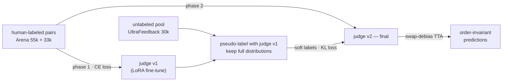

<p align="center">
  
</p>

<div align="center">

[](https://github.com/DaoyuanLi2816/pairjudge/actions)
[](https://pypi.org/project/pairjudge/)

[](LICENSE)
[](https://www.kaggle.com/competitions/lmsys-chatbot-arena/leaderboard)

</div>

`pairjudge` is the generalized core of the **4th-place (gold medal) solution** to Kaggle's [LMSYS — Chatbot Arena Human Preference Predictions](https://www.kaggle.com/competitions/lmsys-chatbot-arena/overview) (1,849 teams), extracted into a small, tested library you can run on **your own preference data with any Hugging Face backbone**. The exact competition artifacts are preserved untouched in [`competition/`](competition/README.md), and a golden test pins the library's default behavior to the medal-winning code **byte for byte**.

Use it when you need a model that answers: *given a prompt and two candidate responses, which one would a human prefer — or is it a tie?* That model is the engine behind response reranking, A/B evaluation of fine-tunes, RLHF/RLAIF reward signals, and arena-style leaderboards.

## Why not just an off-the-shelf reward model?

Three problems show up the moment you train a pairwise judge on real conversations, and they are exactly what this library packages:

**1. Truncation silently destroys the comparison.**
A judge input holds a multi-turn conversation *plus two responses per turn*. With naive left- or right-truncation, long inputs routinely lose response B (or the prompt) entirely — the judge then learns position artifacts instead of preferences. `PairPacker` packs rounds greedily and, when the budget runs out, truncates the final round *proportionally* (default 20% prompt / 40% response A / 40% response B), marks every cut with an explicit ellipsis, and drops rounds that can't be shown honestly. Guarantee: never exceeds `max_length`, and every retained round shows all three fields.

<table>
  <tr>
    <th align="left" colspan="8">One packed example — fixed <code>max_length</code> token budget</th>
  </tr>
  <tr>
    <td align="center" rowspan="2">&nbsp;<code>BOS</code>&nbsp;</td>
    <td align="center" colspan="3"><b>Round 1</b> — fits in full</td>
    <td align="center" colspan="3"><b>Round 2</b> — over budget → proportional truncation</td>
    <td align="center" rowspan="2">verdict<br>prompt<br>+ <code>EOS</code></td>
  </tr>
  <tr>
    <td align="center">prompt</td>
    <td align="center">response&nbsp;A</td>
    <td align="center">response&nbsp;B</td>
    <td align="center">prompt&nbsp;<code>……</code><br><sub>20% of remainder</sub></td>
    <td align="center">response&nbsp;A&nbsp;<code>……</code><br><sub>40% of remainder</sub></td>
    <td align="center">response&nbsp;B&nbsp;<code>……</code><br><sub>40% of remainder</sub></td>
  </tr>
</table>
<sub>A round that would get fewer than <code>min_tail_budget</code> (default 80) content tokens is dropped entirely, along with every later round; <code>……</code> marks each cut. Response B can never be silently pushed out of the sequence.</sub>

**2. Pairwise judges have position bias.**
Swap A and B and a naive judge changes its verdict on a measurable fraction of pairs. `PairwiseJudge.predict_proba(swap_debias=True)` scores each pair in both orders and averages in the original frame — order-invariant by construction. `position_flip_rate()` measures how biased your judge is before you decide to pay the 2x compute.

**3. Human preference labels are scarce and noisy.**
The medal recipe is a two-phase semi-supervised loop: train on human labels → pseudo-label a large unlabeled pool with **full probability distributions** → retrain with soft-label KL distillation (`label_mode: soft`). Ties are a first-class third category throughout — real human preference data is full of them, and scalar Bradley–Terry reward models (e.g. TRL's `RewardTrainer`, `num_labels=1`) cannot represent them.

## Install

```bash
pip install -e .              # core: packing + data loaders (no torch needed)
pip install -e .[judge]       # + inference (torch, transformers)
pip install -e .[train]       # + LoRA fine-tuning (peft, datasets, accelerate)
```

## 60 seconds

```python
from pairjudge import PairPacker, PackerConfig, from_pairs

# 1. Pack pairwise conversations into a token budget — any HF tokenizer.
from transformers import AutoTokenizer
tok = AutoTokenizer.from_pretrained("Qwen/Qwen2.5-0.5B-Instruct")
packer = PairPacker(tok, PackerConfig(max_length=2048))
packed = packer.pack(
    prompts=["Explain quantum entanglement to a 10-year-old."],
    responses_a=["Imagine two magic coins..."],
    responses_b=["Quantum entanglement is a physical phenomenon..."],
)
packed.input_ids      # <= 2048 tokens, prompt + BOTH responses guaranteed visible
packed.truncated      # False — everything fit

# 2. Judge a pair with a trained model, position-bias-free.
from pairjudge import PairwiseJudge
judge = PairwiseJudge.from_pretrained("path/to/your/judge")
df = from_pairs(
    prompts=["Explain quantum entanglement to a 10-year-old."],
    responses_a=["Imagine two magic coins..."],
    responses_b=["Quantum entanglement is a physical phenomenon..."],
)
judge.predict_proba(df, swap_debias=True)   # [[p_a_wins, p_b_wins, p_tie]]
judge.position_flip_rate(df)                # how order-sensitive is my judge?
```

## Train your own judge

```bash
# Small judge on one consumer GPU (Qwen2.5-0.5B, ungated):
python -m pairjudge.training --cfg examples/configs/quickstart.yaml

# The competition setup (gemma-2-9b-it, 4x A100):
python -m pairjudge.training --cfg examples/configs/reproduce_competition.yaml
```

Input is either an Arena-format CSV (the Kaggle competition schema) or a parquet with canonical columns — `prompt` / `response_a` / `response_b` as per-round string lists plus one-hot (or soft) `winner_*` columns. `pairjudge.data` ships loaders for Arena CSVs and UltraFeedback-style chosen/rejected data, plus `from_pairs()` for plain Python lists.

The full two-phase distillation loop:



```bash
# Phase 1: train on human labels
python -m pairjudge.training --cfg phase1.yaml                  # label_mode: hard

# Pseudo-label an unlabeled pool with the phase-1 judge (soft labels)
python -m pairjudge.pseudo_label \
    --model ./output/judge/merged \
    --data pool.parquet --out pool_pl.parquet --swap-debias

# Phase 2: retrain from scratch on human + soft labels with KL loss
python -m pairjudge.training --cfg phase2.yaml                  # label_mode: soft
```

In the competition, this loop (88k human-labeled + 30k pseudo-labeled UltraFeedback conversations) was a decisive part of the gap between a good model and a gold-medal one.

## Inference guardrails

Two degenerate cases are worth handling outside the model — on competition data this was worth a measurable amount of log-loss:

```python
from pairjudge import empty_and_identical_masks

a_empty, b_empty, identical = empty_and_identical_masks(raw_df)
proba[a_empty]  = [0.04, 0.88, 0.08]   # empty response loses — but never bet 1.0
proba[b_empty]  = [0.88, 0.04, 0.08]   # labels are noisy; log-loss punishes overconfidence
proba[identical] = [0.06, 0.06, 0.88]  # identical responses are a tie
```

## How it relates to TRL's `RewardTrainer`

| | TRL `RewardTrainer` | `pairjudge` |
|---|---|---|
| Output | scalar reward (`num_labels=1`) | 3-class distribution (A / B / **tie**) |
| Loss | Bradley–Terry (logsigmoid of reward gap) | CE on human labels, KL on soft pseudo-labels |
| Ties | not representable | first-class |
| Multi-turn pair truncation | generic | proportional, all-fields-guaranteed |
| Position bias | n/a at inference (scores singletons) | swap-debias averaging + flip-rate diagnostic |

If you need a scalar reward for PPO-style RLHF, use TRL. If you need a *judge* that compares two concrete responses — for evaluation, reranking, data labeling, or arena prediction — and your data has ties, this is the recipe that placed 4th of 1,849 on exactly that task.

## Measured: position bias on real preference data

How big is position bias in practice? [`examples/position_bias_experiment.py`](examples/position_bias_experiment.py) trains a judge end to end through the library's public API and measures it on real data — Qwen2.5-0.5B-Instruct, LoRA, 16k training pairs from the public [Arena 55k](https://huggingface.co/datasets/lmarena-ai/arena-human-preference-55k) dataset, 2,000 held-out pairs, one RTX 4080 (16 GB), ~25 minutes:

> The judge **changes its verdict on 29.2% of pairs** when the same two responses are presented in the opposite order.

| metric (2,000 held-out pairs) | single pass (A, B) | swap-debiased |
|---|---|---|
| log-loss | 1.0496 | **1.0462** |
| accuracy | 45.6% | 45.1% |

Swap debiasing improves the proper scoring metric (log-loss) and, by construction, makes the verdict independent of presentation order; top-1 accuracy stays flat within noise at this model scale. The same averaging was part of the gold-medal submission at 9B scale. Reproduce with:

```bash
pip install -e .[train] datasets
python examples/position_bias_experiment.py
```

Numbers above are from a small judge trained in 25 minutes — treat them as a bias *measurement*, not a quality ceiling; a library-native config close to the competition phase-1 recipe (gemma-2-9b-it, ~88k pairs, max_length 2048) is in `examples/configs/reproduce_competition.yaml`. (The gold run's pseudo-label pass used max_length 3072 over ~100k pairs; see `competition/`.)

## Provenance & validation

- The competition scripts, configs, inference notebook and certificate are preserved verbatim in [`competition/`](competition/README.md), including the full original write-up.
- `tests/test_packing.py::TestCompetitionEquivalence` fuzzes 1,500 conversations against a verbatim copy of the competition tokenizer ([`tests/reference_impl.py`](tests/reference_impl.py)) and asserts byte-identical output with default settings — the library *is* the medal-winning code, not a reimplementation of it.
- Final leaderboard: **4th / 1,849** ([gold medal](https://www.kaggle.com/certification/competitions/distiller/lmsys-chatbot-arena), $20,000 prize).

<p align="center">
  <a href="https://www.kaggle.com/certification/competitions/distiller/lmsys-chatbot-arena">
    
  </a>
</p>

## Citation

```bibtex
@misc{li2024pairjudge,
  author = {Daoyuan Li},
  title  = {pairjudge: pairwise LLM judges with budget-aware packing and position-bias correction},
  year   = {2024},
  url    = {https://github.com/DaoyuanLi2816/pairjudge},
  note   = {Generalized from the 4th-place solution, Kaggle LMSYS Chatbot Arena Human Preference Predictions}
}
```

## License

MIT — see [LICENSE](LICENSE).

## Author

Daoyuan Li — [Kaggle (distiller)](https://www.kaggle.com/distiller) · lidaoyuan2816@gmail.com
